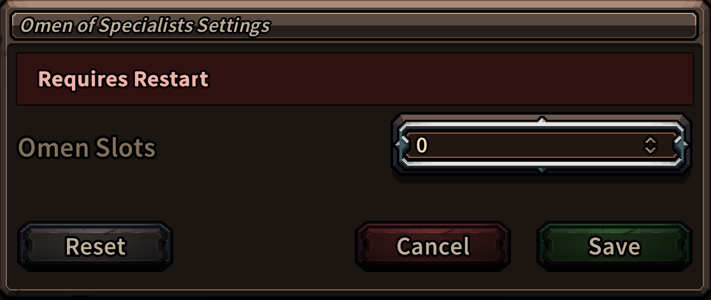

### The Last Spell MCM
Mod Configuration Manager

[](https://github.com/stunl0ck/tls-mcm)
[-blue)](https://github.com/BepInEx/BepInEx/releases/tag/v5.4.23.3)

**Download:** [Nexus](https://www.nexusmods.com/thelastspell/mods/31) · **BepInEx 5 (x64):** [Release](https://github.com/BepInEx/BepInEx/releases/tag/v5.4.23.3)

---

<video src="https://github.com/user-attachments/assets/505f2ccd-b78c-49e7-a840-728789df78c7" width="720" controls></video>


## Summary

**MCM** is a lightweight, drop‑in **in‑game settings UI** for BepInEx mods in *The Last Spell*. Supported mods are injected into the game’s native **Mods** window, where the player can tweak settings.

- Native look & feel (reuses the game’s UI templates)
- Toggle & dropdown controls (more types can be added later)
- Per‑mod config persistent **saving** between sessions.
- Optional localization via `languages.csv`

> Works great alongside **TLS.ModKit** for data‑only mods that expose a few options.

## Installation

### 1) Install BepInEx 5 (x64)
- Download **[BepInEx_win_x64_5.4.23.3.zip](https://github.com/BepInEx/BepInEx/releases/tag/v5.4.23.3)**
- Extract it **into your game folder** e.g. → `C:\Program Files (x86)\Steam\steamapps\common\The Last Spell\`
> Tip: run the game once so BepInEx creates its subfolders.

### 2) Install Mod Configuration Manager
- Download **[MCM](https://www.nexusmods.com/thelastspell/mods/31?tab=files)**
- Extract into:
`...\The Last Spell\BepInEx\plugins\`
- Result: `...\The Last Spell\BepInEx\plugins\ModConfigManager`
 
### 3) Launch the game → open **Mods** → click **Configure** on a mod that supports MCM.

> Mods that use MCM will mention it in their description. MCM itself does nothing visible unless a mod integrates it.



## Installation (Mod Authors)

### 1) Ship a minimal `config.json`

Place this next to your plugin DLL (same folder as your mod’s `.dll`).

```json
{
  "modId": "com.yourname.yourmod",
  "modName": "Your Mod",
  "version": "1.0.0",
  "author": "you",
  "description": "Short description.",
  "config": {
    "EnableThing": {
      "type": "checkbox",
      "value": true,
      "displayName": "Enable Thing",
      "description": "Turns the thing on."
    },
    "Preset": {
      "type": "dropdown",
      "value": "Normal",
      "options": ["Easy", "Normal", "Hard"]
    }
  }
}
```

Supported types (today): `checkbox`/`toggle`, `dropdown`.  

### 2) Register & read values

In your BepInEx `Plugin.cs`

```csharp
using Stunl0ck.ModConfigManager;
```

In your plugin’s `Awake()`:

```csharp
MCM.Register(this); // once
```

At runtime:

```csharp
// Call this
GetValue<T>(string modId, string key, T fallback = default)
```

```csharp
// Examples
bool enabled = MCM.GetValue<bool>("com.yourname.yourmod", "EnableThing", true);
string preset = MCM.GetValue<string>("com.yourname.yourmod", "Preset", "Normal");
```

> Values persist when the player presses **Save** in the MCM popup

### 3) (Optional) Localization

Add a `MCM/languages.csv` in a folder next to your DLL:

```
Key;English;Français;
com.raceselector.mod_description;Allows you to toggle/change...;Permet d’activer/désactiver... 
com.yourname.yourmod_EnableThing_displayName;Enable Thing;Activer la chose
com.yourname.yourmod_EnableThing_description;Turns the thing on.;Active la chose.
com.yourname.yourmod_Preset_displayName;Preset;Préréglage
```

**Key pattern MCM looks for:**

- `{modId}_{optionKey}_displayName`
- `{modId}_{optionKey}_description`
- `{modId}_description` (for main mod description)

MCM merges all `languages.csv` files it finds in each plugin folder on game start.

### 4) Folder layout (example)

```
BepInEx/
└─ plugins/
   ├─ ModConfigManager/
   │  ├─ ModConfigManager.dll
   │  ├─ MCM                       (MCM's internal translations)
   │  └  └─ languages.csv          (MCM's internal UI string translations)
   └─ YourMod/
      ├─ YourMod.dll
      ├─ config.json               (required)
      ├─ MCM                       (optional, for MCM translations)
      └  └─ languages.csv          (optional, for your UI string translations)
```

### 5) (Optional) Reload required ?

If your MCM change requires a reload (e.g. if it changes database files) include the optional `requireReload`

```json
{
  "modId": "com.yourname.yourmod",
  "modName": "Your Mod",
  "version": "1.0.0",
  "author": "you",
  "description": "Short description.",
  "requireReload": true,
  ...
```

## Example Mods

- **Race Selector** — allows you to adjust starting hero spawn settings and exposes toggles for which races can spawn in your runs.  
  [Nexus](<https://www.nexusmods.com/thelastspell/mods/33>) · [GitHub](<https://github.com/stunl0ck/tls-race-selector>)

- **Omen of Specialists** — adds a new Omen that grants the *`Specialist`* perk to all heroes, exposes a dropdown to adjust omen slot cost.  
  [Nexus](<https://www.nexusmods.com/thelastspell/mods/32>) · [GitHub](<https://github.com/stunl0ck/tls-omen-of-specialists>)

> Each example shows how to use `GetValue<T>(string modId, string key, T fallback = default)`

## Recommended: TLS.ModKit

- Download [Nexus](<https://www.nexusmods.com/thelastspell/mods/30>)
- Getting started: [GitHub](<https://github.com/stunl0ck/tls-modkit>)

> **Optional framework to assist your mods**. Mods built purely with *TLS.ModKit* will show up in the *Mods* window too!

## Notes

- **UI:** Injects mod entries each with a “Configure” button in the game’s **Mods** view and opens a `GenericPopUp`. Controls are composed from the game’s toggle/dropdown templates to keep styling consistent.
- **Persistence:** Values are staged until **Save**; then written and available via `MCM.GetValue<T>()` immediately.
- **Safety:** If an option is missing, use the overload with a default value to avoid nulls (`GetValue<T>(…, defaultValue)`).
- **Save data location:** MCM writes each mod’s settings to: `…\The Last Spell\BepInEx\config\ModConfigManager\`. Files are named after the mod’s ID, e.g. `com.yourname.yourmod.json` You can back up or share these JSON files.


## License

MIT
